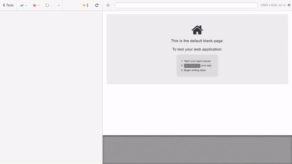

# Testing frontend applications with Cypress


[Cypress](https://www.cypress.io/how-it-works/) is an all-in-one testing framework, assertion library, with mocking and stubbing, all without Selenium.
## Cypress installation
Cypress is realy easy to install, just use your package manager:
npm
```sh
npm install cypress --save-dev
```
or yarn: 
```sh
yarn add -D cypress
```
## Running Cypress
After Cypress installation you can call it from your project root:
```sh
./node_modules/.bin/cypress open
```
While there’s nothing wrong with writing out the full path to the Cypress executable each time, it’s much easier and clearer to add Cypress commands to the scripts field in your package.json file.
```json
{
  "scripts": {
    "cypress:open": "cypress open"
  }
}
```
 Now you can call cypress via:
 ```sh
 npm run cypress:open
 ```
## Setting up CI
Configure Cypress in CI is almost the same as running it locally. You generally only need to do two things:

* Install Cypress
```sh
npm install cypress --save-dev
```
* Run cypress 
```sh
cypress run
```
## Feature tests examples
Cypress uses pretty simple DSL for writing tests

```js
describe("Home", () => {

  beforeEach(() => {
    cy.visit("/");
    cy.get("input").first().type("test@email.com");
    cy.get("input").last().type("password");
    cy.server();
  });

  it("Should login with email and password", () => {
    cy.route("POST", "/api/v1/admin/user_token", "fixture:login.json");
    cy.route("GET", "/api/v1/admin/contacts", "fixture:contacts.json");
    cy.get("button").click();
    cy.url().should("include", "/contacts");
  });

  it("Should not login ", () => {
    cy.route("POST", "/api/v1/admin/user_token");
    cy.get("button").click();
    cy.get(".notices").contains("Invalid login or password");
    cy.url().should("include", "/login");
  });
});
```
[More examples](examples/)
## Fixtures examples
Fixtures load a fixed set of data located in a file.
It is very useful if you want to stub server response.
For example, after login we need to include access token in the server response, we will create a file:

```fixtures/login.json```
```json
{
  "token": "eyJhbGciOiJIUzI1NiIsInR5cCI6IkpXVCJ9.eyJzdwpMeJf36POk6yJV_adQssw5c"
}
```
Or return users data after GET request to ```/users``` page 

```fixtures/users.json```
```json
{ 
  "data": [
    { "id": 1, "attributes": { "name": "John", "email": "john@snow.qwe", "id": 1 } },
    { "id": 2, "attributes": { "name": "Ned", "email": "ned@stark.com", "id": 2  } }
  ]
}
```
## License
Copyright © 2015-2018 Codica. It is released under the [MIT License](https://opensource.org/licenses/MIT).

## About Codica

[](https://www.codica.com)

We love open source software! See [our other projects](https://github.com/codica2) or [hire us](https://www.codica.com/) to design, develop, and grow your product.